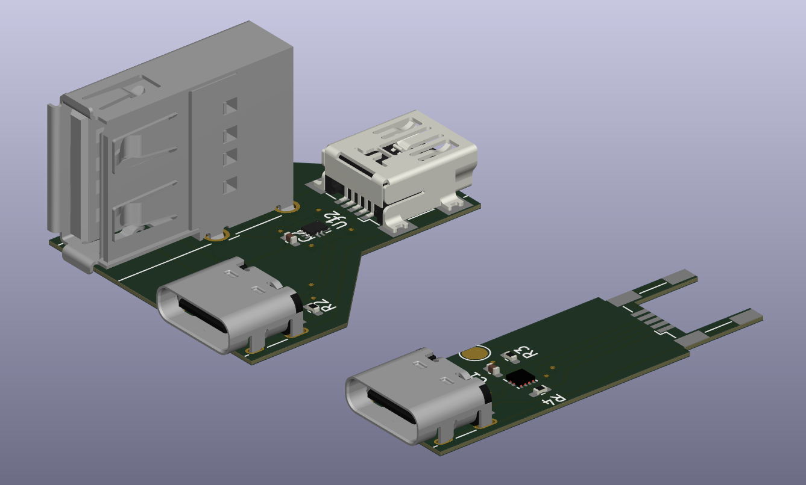
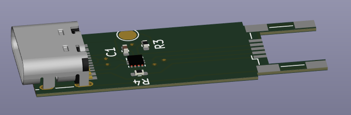
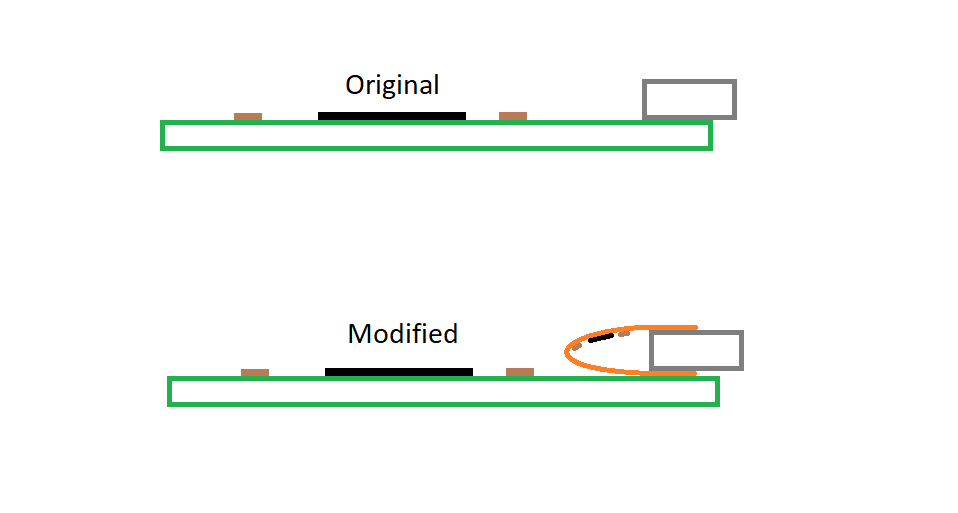

This project converts a USB Mini-B port to USB Type-C (and/or USB Type-A), by use of either a USB "switch" or the TUSB320 IC from Texas Instruments.

The intent is to retain the OTG/DRP functionality of the Mini0B port while updating to the more modern Type-C (and more prolific Type-A) connector(s).

The "Single Port" design is intended to replace the Mini-B connector with a Type-C connector in situ, with minimal modification needed outide of removing the origial Mini-B port.

The "Double Port" design is intended as an adapter, plugging into the existing Mini-B connector, and bring the host functionality to the Type-A port, and the device to Type-C.

